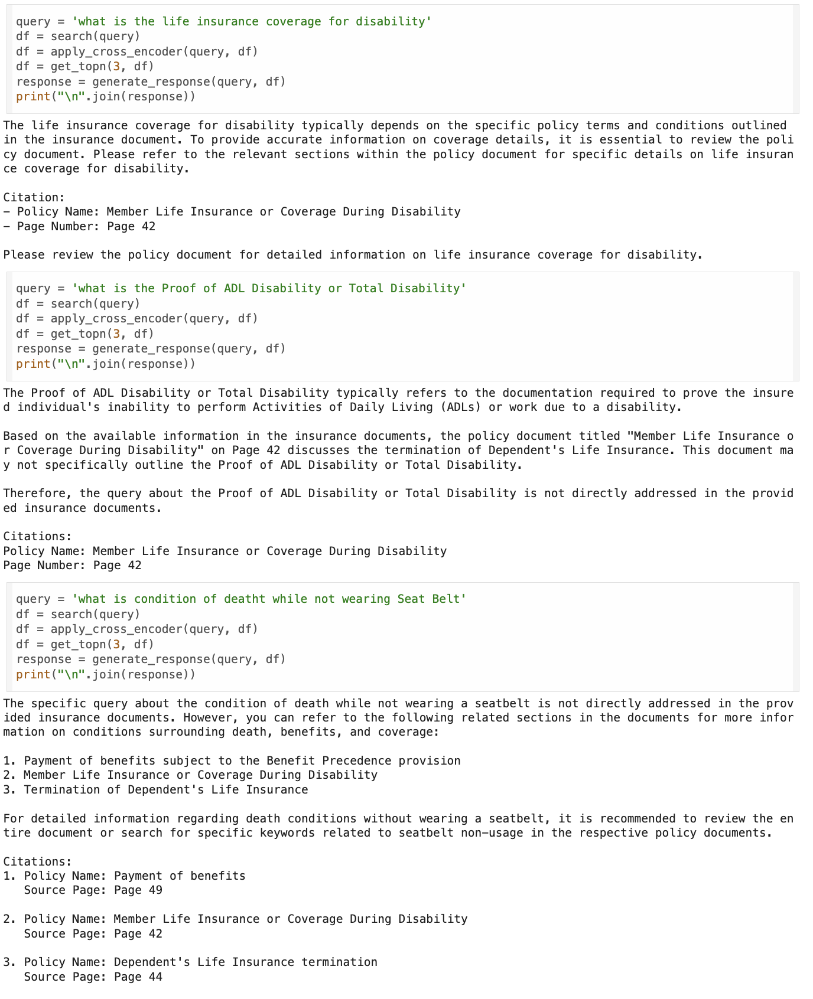

# 🚀 Building Effective Search Systems – HelpMateAI  

## 1. 📝 Background  
This project demonstrates **“Building Effective Search Systems – HelpMateAI”** by leveraging a long life insurance policy document and applying **Retrieval Augmented Generation (RAG)** techniques.  

## 2. 🎯 Problem Statement  
The aim of this project is to design a **robust and reliable generative search system** that can accurately answer questions derived from an insurance policy document.  
For experimentation, we will be working with a single comprehensive life insurance policy file.  

## 3. 📄 Reference Document  
- The policy document is available here: [Principal-Sample-Life-Insurance-Policy.pdf]  

## 4. 🛠 Approach  
The system is structured into **three layers**, each requiring careful design and experimentation.  

### 🔹 Embedding Layer  
- 🧹 Preprocess and clean the policy document.  
- 📏 Break the content into meaningful **chunks** for embeddings.  
- 🤖 Experiment with embedding models such as **OpenAI embeddings** or **SentenceTransformers** from HuggingFace.  

### 🔹 Search Layer  
- 📝 Design at least **three representative queries** based on the policy.  
- 📂 Store embeddings in **ChromaDB** and perform semantic search.  
- ⚡ Add a **cache mechanism** to improve efficiency.  
- 🎯 Apply **cross-encoder re-ranking** to enhance retrieval relevance.  

### 🔹 Generation Layer  
- 🏗 Construct a carefully engineered **prompt** with retrieved context.  
- ✅ Ensure comprehensive instructions and pass relevant data into the model.  
- ✨ Optionally, use **few-shot examples** to refine output quality.  

## 5. 🧩 System Layers  

- 📑 **Reading & Processing PDFs:** Implemented using [pdfplumber](https://pypi.org/project/pdfplumber/) for structured text, tables, and image extraction.  
- ✂️ **Document Chunking:** Start with fixed-size chunking, with scope for improvements.  
- 🔡 **Embedding Generation:** Use **SentenceTransformer (all-MiniLM-L6-v2)** for embeddings.  
- 🗂 **ChromaDB Storage:** Efficiently store embeddings for quick retrieval.  
- ⚡ **Semantic Search + Cache:** Introduce a caching mechanism for repeated queries.  
- 🎯 **Re-Ranking:** Use a cross-encoder model to refine the relevance of retrieved results.  
- 🤖 **Retrieval-Augmented Generation:** Feed top results with context to **GPT-3.5** for final answers with citations.  

## 6. 🖼 System Architecture  
  

## 7. ⚙️ Prerequisites  
- 🐍 Python **3.7+**  
- 🔑 Add your **OpenAI API Key** to the `OpenAI_API_Key` file.  

## 8. 📸 Sample Q&A Demonstrations  
  

## 9. 👨‍💻 Author  
- **Sravana Kumar Sanka**  
